# 🚀 EKS ArgoCD GitOps Project

Provisioning an Amazon EKS cluster with Terraform and deploying applications using ArgoCD for GitOps-based continuous delivery.

---

## 📑 Table of Contents

- [Overview](#overview)
- [Architecture](#architecture)
- [Prerequisites](#prerequisites)
- [Project Structure](#project-structure)
- [Step-by-Step Walkthrough](#step-by-step-walkthrough)
- [Cleanup](#cleanup)

---

## Overview

This project demonstrates a complete GitOps workflow on AWS using:

- **Terraform** — Infrastructure as Code to provision the EKS cluster, VPC, subnets, IAM roles, and node groups
- **Amazon EKS** — Managed Kubernetes cluster running on AWS (Kubernetes v1.31)
- **ArgoCD** — GitOps continuous delivery tool that syncs Kubernetes manifests from a Git repository to the cluster
- **kubectl** — Kubernetes CLI for interacting with the cluster
- **AWS EC2** — Worker nodes running Amazon Linux 2023 (t3.medium instances)

The infrastructure consists of 25 AWS resources provisioned automatically via Terraform, including a custom VPC, public and private subnets, NAT gateways, internet gateway, route tables, IAM roles, the EKS control plane, and a managed node group.

---

## Architecture

The architecture follows a GitOps model:

1. Infrastructure is defined as code using Terraform
2. Terraform provisions the EKS cluster on AWS
3. ArgoCD is deployed into the cluster and connected to this Git repository
4. ArgoCD continuously syncs Kubernetes manifests from Git to the cluster
5. Any change pushed to Git is automatically applied to the cluster

**AWS Resources provisioned:**
- VPC with public and private subnets across multiple availability zones
- Internet Gateway and NAT Gateway
- EKS Control Plane (managed by AWS)
- Managed Node Group (t3.medium EC2 instances)
- IAM Roles and Policies for EKS and node groups
- Security Groups

---

## Prerequisites

Before you begin, ensure you have the following installed and configured:

- **AWS CLI** — configured with appropriate IAM permissions
- **Terraform** >= 1.0
- **kubectl** — Kubernetes CLI
- **Helm** — Kubernetes package manager
- An **AWS account** with permissions to create EKS, VPC, IAM, and EC2 resources
- A **GitHub account** with a repository for your Kubernetes manifests

---

## Project Structure

```
eks-argocd-gitops/
├── screenshots/
│   ├── 01-file-structure.png
│   ├── 02-terraform-init.png
│   ├── 03-terraform-plan.png
│   ├── 04-terraform-apply-30-seconds.png
│   ├── 05-at-three-minutes.png
│   ├── 06-apply-successful.png
│   ├── 07-nodes.png
│   ├── 08-EKS.png
│   ├── 09-ArgoCD-login-page.png
│   ├── 09-ArgoCD-pods-are-alive.png
│   ├── 10-ArgoCD.png
│   ├── 11-ArgoCD-syncing.png
│   ├── 12-ArgoCD-sync.png
│   ├── 13-kubectl-get-A.png
│   ├── 14-loadbalancers.png
│   ├── 15-ec2-instances.png
│   └── 16-cluster-deleting.png
├── .gitignore
├── LICENSE
└── README.md
```

---

## Step-by-Step Walkthrough

### Step 1 — Project File Structure

The Terraform configuration is organized into modular files for maintainability.

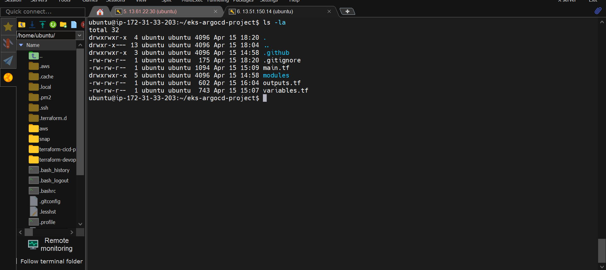

---

### Step 2 — Terraform Init

Initialize Terraform to download the required providers and modules.

```bash
terraform init
```

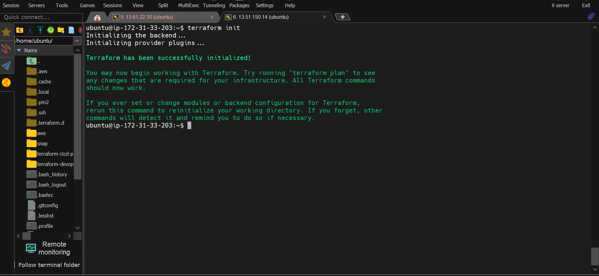

---

### Step 3 — Terraform Plan

Review the infrastructure plan. Terraform will show all 25 resources it intends to create.

```bash
terraform plan
```

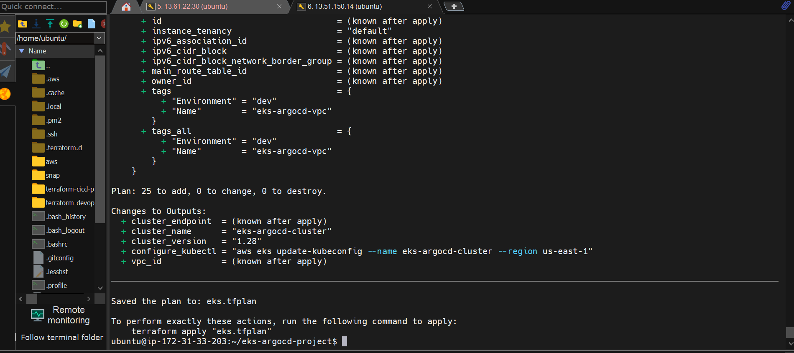

---

### Step 4 — Terraform Apply (Starting)

Apply the Terraform configuration to begin provisioning the infrastructure.

```bash
terraform apply --auto-approve
```

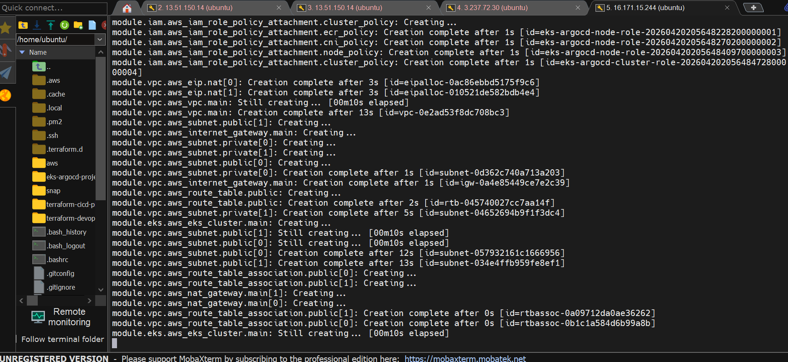

---

### Step 5 — Terraform Apply (In Progress)

The apply continues, provisioning VPC components, subnets, IAM roles, and the EKS control plane.

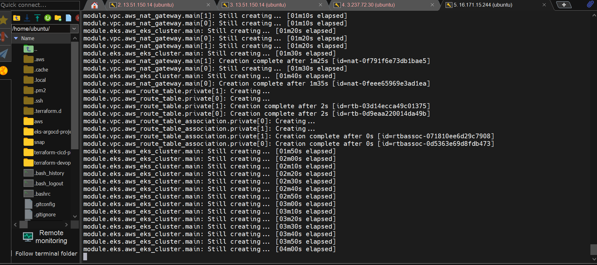

---

### Step 6 — Terraform Apply Successful

All 25 resources are successfully created. Terraform outputs the cluster name and endpoint.

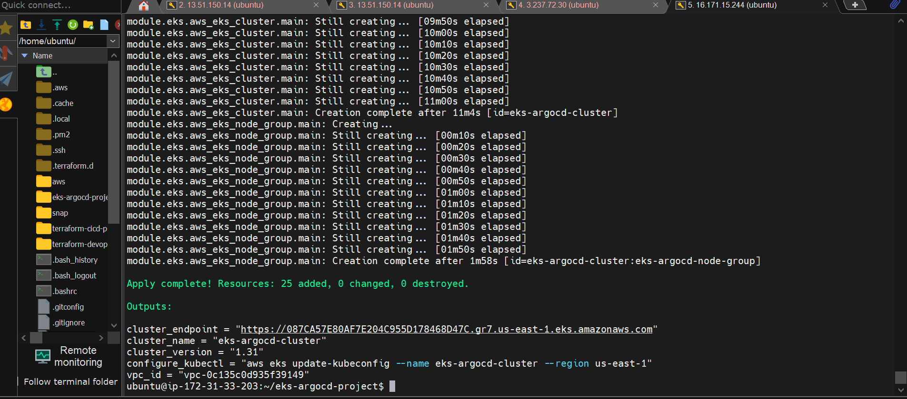

---

### Step 7 — Verify Kubernetes Nodes

Update your kubeconfig and verify the worker nodes are Ready.

```bash
aws eks update-kubeconfig --region <your-region> --name <your-cluster-name>
kubectl get nodes
```

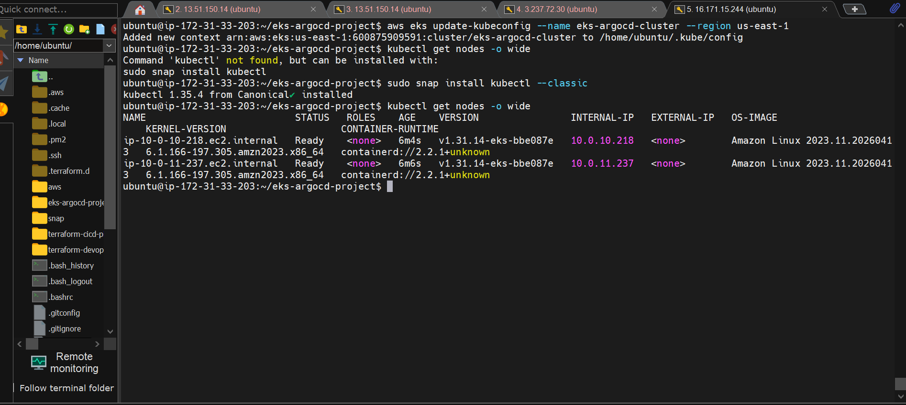

---

### Step 8 — EKS Cluster on AWS Console

Verify the EKS cluster is active and healthy in the AWS Management Console.

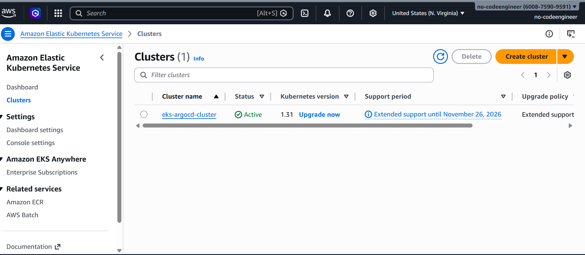

---

### Step 9 — Deploy ArgoCD

Install ArgoCD into the cluster using kubectl.

```bash
kubectl create namespace argocd
kubectl apply -n argocd -f https://raw.githubusercontent.com/argoproj/argo-cd/stable/manifests/install.yaml
kubectl get pods -n argocd
```

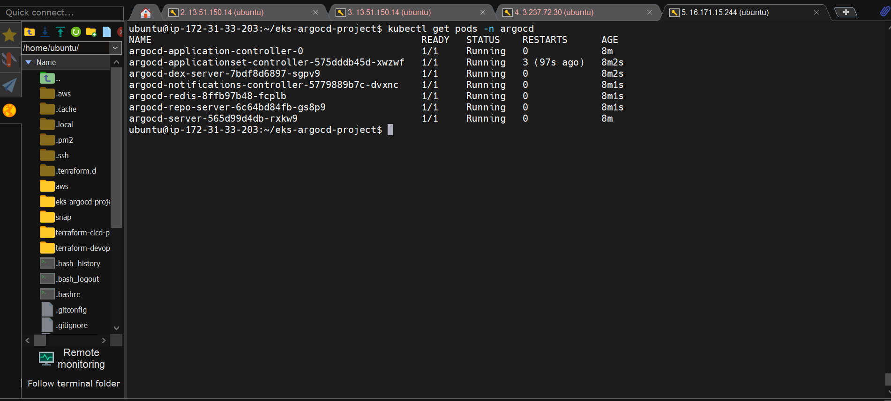

---

### Step 10 — Access ArgoCD Login Page

Expose the ArgoCD server and retrieve the initial admin password.

```bash
kubectl patch svc argocd-server -n argocd -p '{"spec": {"type": "LoadBalancer"}}'
kubectl -n argocd get secret argocd-initial-admin-secret -o jsonpath="{.data.password}" | base64 -d
```

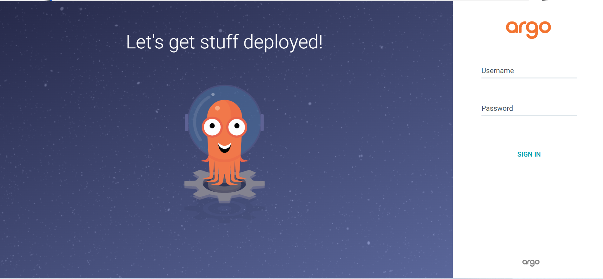

---

### Step 11 — ArgoCD Dashboard

Log in with username `admin` and the retrieved password.

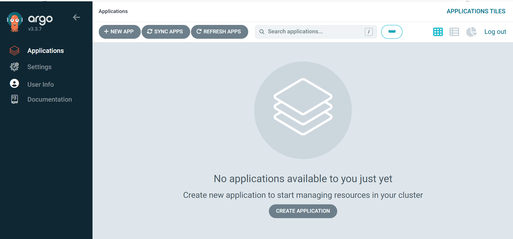

---

### Step 12 — ArgoCD Syncing

ArgoCD detects the application manifests in the Git repository and begins syncing them to the cluster.


---

### Step 13 — ArgoCD Sync Complete

The application is fully synced and healthy. Live state matches the desired state in Git.

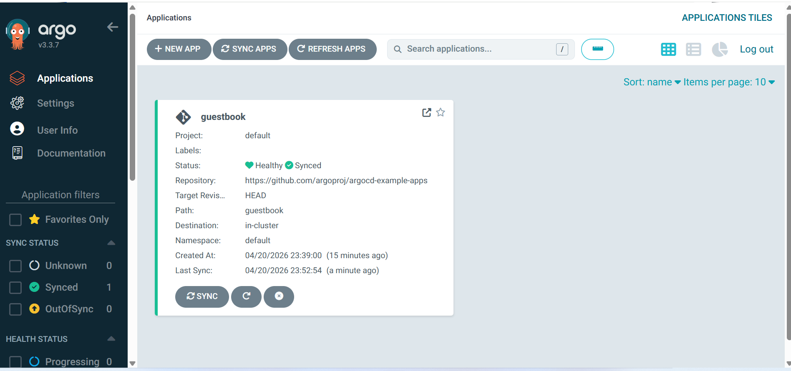

---

### Step 14 — Verify All Resources

Verify all Kubernetes resources are running across all namespaces.

```bash
kubectl get all -A
```

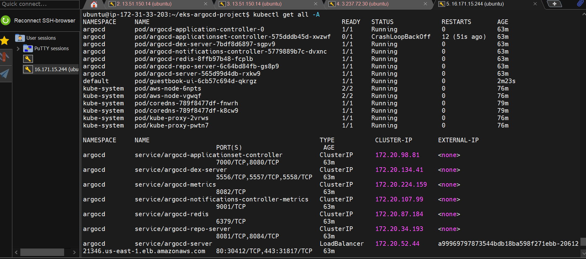

---

### Step 15 — Load Balancers on AWS Console

The application LoadBalancer is visible in the AWS EC2 console, confirming the service is exposed externally.

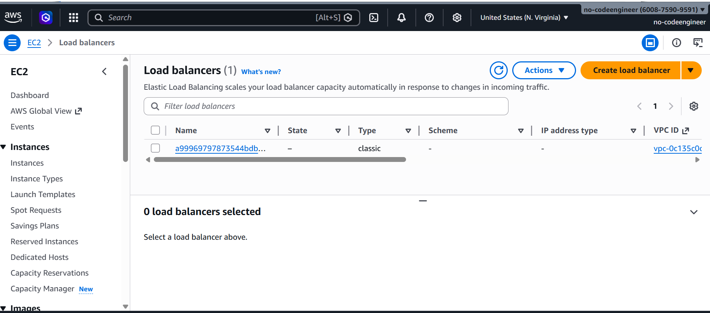

---

### Step 16 — EC2 Instances

The EKS worker nodes (t3.medium) are visible and running in the AWS EC2 console.

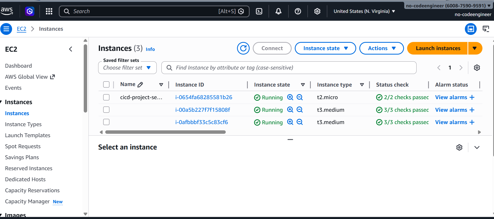

---

## Cleanup

To avoid ongoing AWS charges, destroy all provisioned infrastructure when done.

```bash
terraform destroy --auto-approve
```

Cluster deletion takes approximately 10-15 minutes.

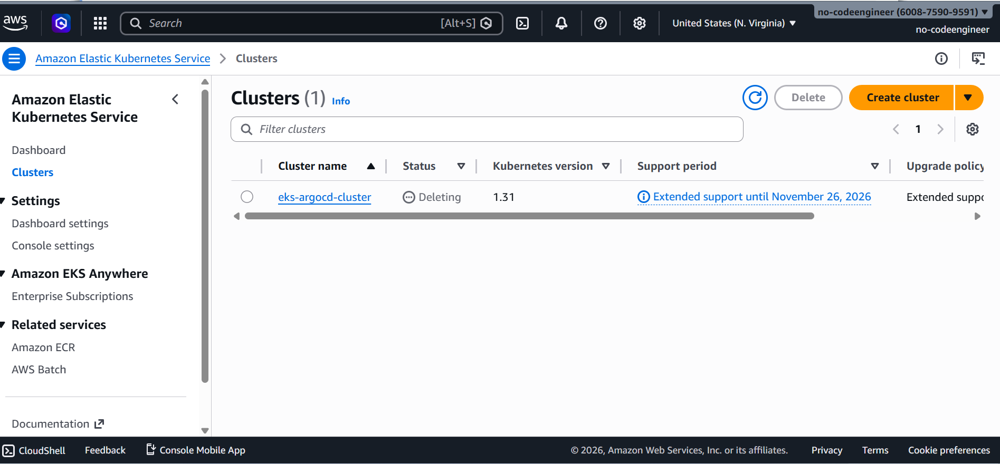

---

## 💡 Key Takeaways

- Terraform makes it easy to provision production-grade EKS clusters repeatably and consistently
- ArgoCD provides a powerful GitOps workflow where Git is the single source of truth
- The combination of Terraform + EKS + ArgoCD represents a modern, industry-standard DevOps stack
- All infrastructure changes are version-controlled and auditable

---

## 📄 License

This project is licensed under the MIT License — see the [LICENSE](LICENSE) file for details.

---

*Built by [isaacambi](https://github.com/isaacambi)*
